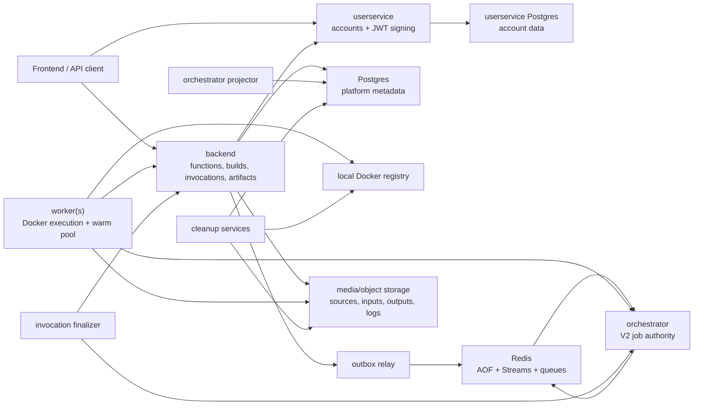
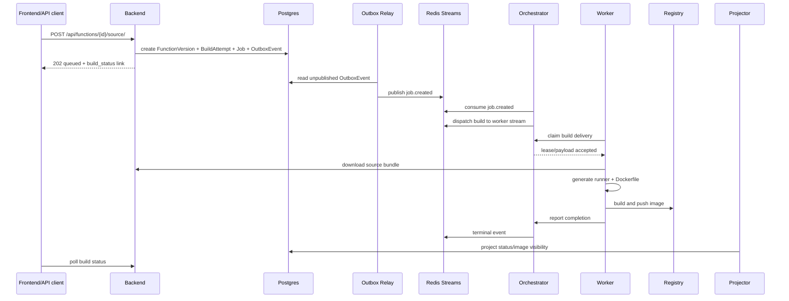
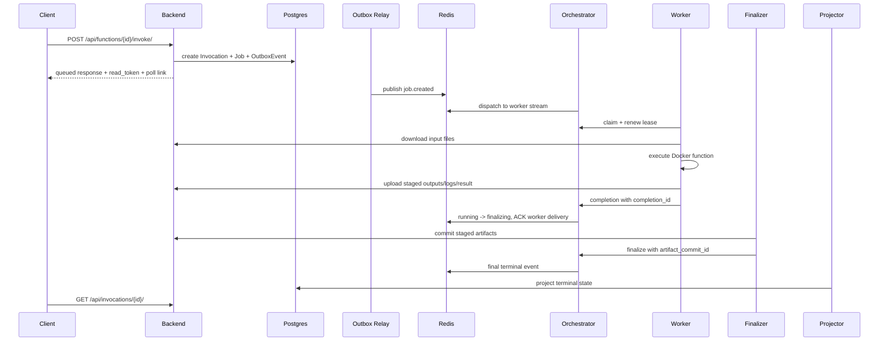

# Project Guide

Last updated: 2026-08-16

This guide is meant for a new model, developer, or reviewer who needs to
understand the project from the repository itself. It is intentionally detailed.
Use it together with the code, `PROJECT_STATUS_REPORT.md`, `README.md`, and the
focused documents under `docs/`.

The project is a lightweight serverless execution platform. The current
prototype can:

1. Register/login users through a separate userservice.
2. Let authenticated users create functions.
3. Upload Python function source from the frontend as a generated ZIP.
4. Build and push Docker images into a local registry.
5. Invoke functions asynchronously or synchronously.
6. Accept JSON events and optional invocation-time input files.
7. Store result JSON, stdout, stderr, declared output files, and invocation ZIPs.
8. Reuse warm containers for faster repeat invocations.
9. Coordinate work through Redis Streams and an orchestrator path.
10. Observe the system through Prometheus, Grafana, Loki, and exporters.

This is still a Docker Compose prototype, not a production platform. The current
work is mostly about correctness, orchestration, prototype usability, and
performance evaluation.

## Repository Map

Top-level directories and important files:

```text
backend/                         Django serverless backend/control plane
userservice/                     Separate Django account/JWT service
worker/                          Worker process, builder, executor, warm pool
scheduler/                       V1 scheduler plus V2 orchestrator/finalizers
frontend/                        Static prototype frontend
observability/                   Prometheus, Grafana, Loki, Alloy configs
scripts/                         Smoke tests, benchmarks, workload scripts
docs/                            Focused design notes and test reports
docker-compose.yml               Local all-in-one prototype stack
docker-compose.control-plane.yml First distributed control-plane stack
docker-compose.worker.yml        First distributed worker-only stack
ROADMAP.md                       Original phase roadmap
README.md                        Current concise project overview
PROJECT_STATUS_REPORT.md         Large status inventory and remaining work
PROJECT_GUIDE.md                 This guide
```

The status report is the broad inventory. This guide explains how the pieces
fit together and what design history led to the current state.

## Current High-Level Architecture



The important split:

- `userservice` owns user accounts and JWT signing.
- `backend` owns serverless product resources: functions, builds, invocations,
  input/output/log artifacts, function invocation tokens, frontend-friendly API
  responses, and internal worker artifact endpoints.
- `orchestrator` owns V2 coordination state in Redis.
- `worker` owns actual Docker build/execution work.
- `PostgreSQL` remains the user-facing read model and persistent metadata
  store.
- `Redis` is the active transport and V2 coordination source.

## Services

### userservice

Path: `userservice/`

The userservice is a separate Django service. We intentionally moved account
login and JWT signing out of the serverless backend because invocation/build
traffic may become heavy, and account management should not be coupled to that
load.

It owns:

- user records
- passwords
- roles (`user`, `admin`)
- register/login/refresh/logout acknowledgement
- JWT private signing key
- public key and JWKS discovery

Important endpoints:

```text
POST /api/auth/register/
POST /api/auth/token/
POST /api/auth/token/refresh/
POST /api/auth/logout/
GET  /api/auth/me/
GET  /api/auth/public-key/
GET  /api/auth/jwks/
GET  /api/schema/
GET  /api/docs/
```

Current token format:

- RS256 JWTs
- issuer: `serverless-userservice`
- audience: `serverless-platform`
- subject: stable userservice user subject
- includes `username`, `email`, `role`, `token_type`, and expiry

The serverless backend verifies userservice JWTs locally through the JWKS
endpoint. It does not call the userservice on every request.

Current bridge limitation:

- The backend still has a local `accounts` app.
- The backend still creates local shadow users from userservice JWT subjects.
- Ownership still uses local foreign keys in several places.
- The intended future migration is to store userservice subjects directly on
  owned resources instead of relying on local shadow users.

See: `docs/userservice_migration.md`.

### backend

Path: `backend/`

The backend is the serverless product API and artifact API. It owns:

- functions
- function versions
- active version selection
- build attempts and build policy
- function images ledger
- invocation records
- invocation inputs
- invocation outputs
- invocation logs
- invocation ZIP downloads
- function invocation tokens
- OpenAPI schema
- CORS behavior
- internal worker/finalizer/projector endpoints

Important apps:

```text
backend/apps/accounts/       temporary compatibility auth bridge
backend/apps/functions/      functions, versions, builds, tokens, source upload
backend/apps/invocations/    invocation records, artifacts, response modes
backend/apps/jobs/           durable jobs, outbox, projection, cleanup
backend/apps/workers/        worker records and admin worker API
backend/apps/health/         health and metrics
```

Important backend product endpoints:

```text
GET|POST /api/functions/
GET|PATCH|DELETE /api/functions/{id}/
POST /api/functions/{id}/source/
GET  /api/functions/{id}/build-status/
GET  /api/functions/{id}/invocations/
GET|POST /api/functions/{id}/tokens/
GET|PATCH|DELETE /api/functions/{id}/tokens/{token_id}/
POST /api/functions/{id}/tokens/{token_id}/revoke/
POST /api/functions/{id}/tokens/{token_id}/rotate/
POST /api/functions/{id}/invoke/
POST /api/functions/{id}/invoke-sync/
GET  /api/invocations/
GET  /api/invocations/{id}/
GET  /api/invocations/{id}/outputs/
GET  /api/invocations/{id}/outputs/{file_id}/download/
GET  /api/invocations/{id}/download/
GET  /api/schema/
GET  /api/docs/
```

Internal backend endpoints use `X-Internal-Token`, not JWTs. Examples:

```text
GET  /api/internal/builds/{build_request_id}/source/
GET  /api/internal/builds/{build_request_id}/state/
PATCH /api/internal/builds/{build_request_id}/report/
GET  /api/internal/invocations/{request_id}/inputs/
GET  /api/internal/invocations/{request_id}/inputs/{file_id}/download/
POST /api/internal/invocations/{request_id}/outputs/
POST /api/internal/invocations/{request_id}/staged-outputs/
POST /api/internal/invocations/{request_id}/staged-completions/{completion_id}/commit/
PATCH /api/internal/invocations/{request_id}/report/
POST /api/internal/auth/userservice-jwks-cache/clear/
```

Do not expose internal endpoints to users.

### worker

Path: `worker/`

The worker performs the expensive work:

- registers/heartbeats to the platform
- consumes assigned work
- claims/leases V2 jobs through the orchestrator
- builds function images
- runs function containers
- manages input/output sandboxes
- validates output artifacts
- uploads staged or committed artifacts
- reports completion
- maintains warm containers
- exposes worker metrics

Key files:

```text
worker/worker.py          worker main loop, Redis Stream consumption, threading
worker/executor.py        invocation execution and Docker sandbox lifecycle
worker/builder.py         image build logic
worker/warm_pool.py       warm container pool and eviction policy
worker/backend_client.py  backend internal API client
worker/orchestrator_client.py orchestrator client
```

The worker currently needs the host Docker socket:

```text
/var/run/docker.sock:/var/run/docker.sock
```

That is acceptable for this prototype but not production-grade isolation.

### scheduler and orchestrator

Path: `scheduler/`

This directory contains historical V1 scheduler code and the current V2
orchestrator ecosystem.

Important files:

```text
scheduler/scheduler.py                 V1 scheduler path
scheduler/production_orchestrator.py   V2 orchestrator HTTP service
scheduler/orchestrator_state.py        Redis/Lua state machine
scheduler/invocation_finalizer.py      commits staged invocation artifacts
scheduler/orphan_image_cleaner.py      deletes orphaned candidate images
scheduler/shadow_orchestrator.py       old V2 shadow comparison path
scheduler/orchestrator_workers.py      Redis worker state helpers
```

Current direction:

- V2 is the intended path.
- Local Compose defaults V2 build and invocation pilots to enabled at 100%.
- Local Compose disables new V1 job creation.
- V1 coordination endpoints remain available for compatibility/drain.
- Avoid adding new V1 behavior unless specifically cleaning it up.

### frontend

Path: `frontend/`

The frontend is dependency-free static HTML/CSS/JS. It is not a React/Vite app
yet. The browser creates a source ZIP client-side, then uploads it to the
backend.

Current implemented flow:

```text
landing page
login/signup
function list
function editor
source code + requirements editor
access mode and input/output settings
build and build status
async invocation
sync invocation
invocation history
invocation token management
result polling
output/download examples
invocation ZIP download
```

Important caveat:

- `docker-compose.yml` currently does not define a frontend service.
- Both Compose configurations define the React/Vite frontend service.
- In local mode, the frontend has usually been served manually:

```powershell
docker compose up -d --build frontend
```

Then open:

```text
http://localhost:5173
```

See: `frontend/README.md` and `docs/frontend_prototype.md`.

### observability

Path: `observability/`

The observability stack is opt-in through the `observability` Compose profile.

Tools:

- Grafana: dashboards and log exploration UI.
- Prometheus: metrics scrape/storage/query engine.
- Loki: log storage/query backend.
- Grafana Alloy: collects Docker logs and ships them to Loki.
- cAdvisor: container CPU/memory/network/filesystem metrics.
- Redis exporter: Redis metrics.
- Postgres exporters: backend DB and userservice DB metrics.

Start with Docker Hub images:

```powershell
docker compose --profile observability up -d prometheus grafana loki alloy cadvisor redis-exporter postgres-exporter userservice-postgres-exporter
```

Start with Runflare mirror images:

```powershell
docker compose -f docker-compose.yml -f docker-compose.mirrors-runflare.yml --profile observability up -d prometheus grafana loki alloy cadvisor redis-exporter postgres-exporter userservice-postgres-exporter
```

Important URLs:

```text
Grafana:    http://localhost:3000
Prometheus: http://localhost:9090
Loki:       http://localhost:3100
Alloy:      http://localhost:12345
cAdvisor:  http://localhost:8081
```

`http://localhost:3100` returning `404` is normal for Loki. Use Grafana or Loki
API paths such as `/ready`, `/metrics`, or `/loki/api/v1/labels`.

See: `docs/observability_stack.md`.

## Data Model

### Function

Model: `backend/apps/functions/models.py`

A function is the user-facing unit. It has:

- owner
- name
- slug
- description
- invoke access mode
- active version pointer

The slug is the URL/image-friendly unique name. It is used in image tags and API
presentation.

Invocation access modes:

```text
private  owner/admin JWT only
token    X-Function-Token
public   no JWT or function token required
```

### FunctionInvokeToken

Function invocation tokens are not JWTs. They are opaque function-scoped
secrets. They exist so a function owner can let another caller invoke one
specific function without giving that caller a platform login token.

Properties:

- stored as SHA-256 hash
- prefix stored for display
- raw token returned only once on create/rotate
- can expire
- can be revoked
- tracks last used time

Use:

```text
X-Function-Token: fn_...
```

See: `docs/invocation_token_management.md`.

### FunctionVersion

Internally, builds still create function versions. Product-wise, we present a
simpler rule:

- a function has one active build/image
- editing source creates a candidate version
- if candidate build succeeds, it becomes active
- if candidate build fails, the old active version remains live

Important fields:

- runtime
- handler
- source bundle
- config
- input file constraints
- declared output filenames
- output size/count limits
- retry policy
- image ref
- build status

Output declarations are intentionally strict: users declare expected output
filenames when building the function, and the platform only publishes those
declared files.

### FunctionImage

The image ledger tracks image lifecycle:

```text
candidate
active
pending_delete
deleted
delete_failed
```

The cleanup command checks this ledger before deleting images from the registry.
It must never delete an image that is currently active for a function.

### BuildAttempt and BuildPolicy

Build attempts provide per-attempt history for a function version.

Build policy is a singleton row controlling:

- max retries
- builds per user per hour
- builds per function per hour
- queued builds per user
- queued builds per function
- global concurrent build leases
- build lease duration

Build concurrency is not just API admission control. Workers acquire build
leases before running Docker builds, so execution concurrency is enforced at the
distributed worker level.

### Invocation

An invocation stores:

- request ID
- function version
- event
- status
- result JSON
- stdout/stderr previews
- exit code
- cold start flag
- retry count
- error message
- auth type used
- function token used, if any
- read token hash/prefix
- timing fields

The invocation read token is returned to public/token callers so they can read
only the invocation they created. It is separate from the function invocation
token.

Use:

```text
X-Invocation-Read-Token: inv_...
```

### InvocationInputFile

Input files are uploaded with the invoke request using `multipart/form-data`.
Django validates and stores them, and the worker later downloads them through
protected internal endpoints.

The function version controls:

- allowed MIME types
- max file count
- max size per file
- max total input size

### InvocationOutputFile

Output files are produced by the function in `/sandbox/output`. The platform
only publishes files that:

- match declared output filenames
- are simple filenames, not paths
- are not `result.json`
- fit per-file and total-size limits
- fit max output file count
- pass staged manifest/fencing checks in V2

### InvocationLogArtifact

stdout and stderr are always captured. The API may expose short previews, but
full logs are stored as artifacts and are intended to be downloaded through the
invocation ZIP, not standalone log endpoints.

### Job and OutboxEvent

`Job` is the durable record tying a build/invocation request to coordination.

Important fields:

- job ID
- type: build/invocation
- status
- coordination version: V1 or V2
- payload
- build attempt or invocation foreign key
- recovery count
- dead-letter fields

`OutboxEvent` is used to publish job-created events to Redis without losing
events across the database/Redis boundary.

## Authentication And Access Rules

There are three different token concepts. Do not confuse them.

### Platform JWT

Issued by userservice.

Used for:

- managing account state
- creating/editing/deleting functions
- uploading source
- managing function invocation tokens
- invoking private functions as owner/admin
- reading owner/admin invocation history and artifacts

Header:

```text
Authorization: Bearer <jwt-access-token>
```

### Function invocation token

Created by function owner/admin in the backend.

Used for:

- invoking a token-protected function

Header:

```text
X-Function-Token: fn_...
```

This does not identify a platform user account. It identifies permission to call
one function.

### Invocation read token

Issued when a public/token caller creates an invocation.

Used for:

- reading one invocation result
- listing/downloading that invocation's outputs
- downloading that invocation ZIP

Header:

```text
X-Invocation-Read-Token: inv_...
```

This prevents token A's caller from reading token B's result.

## Function Lifecycle

Current product semantics are documented in
`docs/prototype_product_semantics.md`.

The intended user-facing model:

1. User creates a function shell.
2. User writes/pastes code and requirements.
3. Frontend creates a ZIP with `handler.py`, `requirements.txt`, and
   `config.json`.
4. Frontend uploads that ZIP to `/api/functions/{id}/source/`.
5. Backend creates a candidate `FunctionVersion`.
6. Backend queues a build job.
7. Worker builds an image and pushes it to the registry.
8. If build succeeds, backend promotes the candidate version to
   `Function.active_version`.
9. If build fails, the old active version remains active.
10. Old/superseded images are marked `pending_delete` and cleaned later.

Changing source means replacing the active build. Users do not choose among many
public function versions in the current product model.

## Build Flow

Current build flow, V2 path:



Important correctness rules:

- A build image is not exposed as active until finalization/projection says it
  is safe.
- Attempt-specific image tags prevent stale attempts from overwriting newer
  attempts.
- Failed candidate builds do not break the existing active function.
- Registry cleanup is asynchronous and re-checks active image ownership before
  deleting.

Build statuses:

```text
pending
queued
building
cancelling
built
failed
cancelled
```

## Invocation Flow

There are two user-facing invocation modes:

1. async invocation: returns quickly with a pollable invocation.
2. sync invocation: waits up to a configured short timeout for JSON-only
   functions and returns result if ready.

### Async Invocation

Endpoint:

```text
POST /api/functions/{id}/invoke/
```

Default response mode is `simple`.

The request can be JSON:

```json
{
  "event": {
    "name": "Ilya"
  }
}
```

Or multipart when input files are present:

```text
event=<json string>
files=<uploaded files>
```

Flow:



The important V2 rule:

> A physical result may exist before the user can see it. It is invisible until
> staged artifacts are committed and the orchestrator emits terminal state.

This solves the inconsistency where output files could exist while the job was
not yet durably completed.

### Sync Invocation

Endpoint:

```text
POST /api/functions/{id}/invoke-sync/
```

Sync invocation is intended for functions without file outputs. It still creates
normal invocation/job records. The backend waits up to
`SYNC_INVOCATION_TIMEOUT_SECONDS` and returns:

- terminal result if complete in time
- an accepted/running response if not complete in time

Sync response mode also defaults to `simple`.

Limits:

```text
SYNC_INVOCATION_TIMEOUT_SECONDS
SYNC_INVOCATION_POLL_INTERVAL_SECONDS
SYNC_INVOCATION_MAX_RESULT_BYTES
SYNC_INVOCATION_MAX_STDOUT_BYTES
SYNC_INVOCATION_MAX_STDERR_BYTES
```

### Response Modes

Response mode can be supplied as:

```text
?response_mode=simple
?response_mode=advanced
```

For invoke endpoints, the body can also include `response_mode`, but the query
parameter is preferred.

`simple` is the default. It returns the caller-oriented result:

- pending state and poll link while queued/running
- function result when terminal
- output file paths/links when terminal
- no large stdout/stderr by default
- no internal orchestration fields

`advanced` returns the dashboard/operator payload:

- status metadata
- stdout/stderr previews
- exit code
- timing
- links
- output metadata
- platform state fields

See: `backend/apps/invocations/response_modes.py` and
`docs/frontend_status_results_api.md`.

## Input And Output Sandboxing

This area has changed several times because output handling was one of the
hardest performance/correctness tradeoffs.

### Input Files

Current flow:

1. User invokes function with JSON event and optional files.
2. Backend validates file count, MIME type, per-file size, and total size.
3. Backend stores input files as `InvocationInputFile` records.
4. Worker downloads input metadata and content through internal endpoints.
5. Worker writes files into the function sandbox under `/sandbox/input/files`.
6. Runner receives:

```text
FUNCTION_EVENT_PATH=/sandbox/input/event.json
FUNCTION_INPUT_FILES_DIR=/sandbox/input/files
FUNCTION_INPUT_FILES_JSON=<metadata JSON>
FUNCTION_OUTPUT_DIR=/sandbox/output
FUNCTION_HANDLER=<handler>
FUNCTION_REQUEST_ID=<request id>
```

### Output Files

Current rule:

- Function return value goes to `result.json`.
- Declared user output files go into `/sandbox/output`.
- `result.json` is reserved and is not a declared output file.
- Output filenames must be simple filenames, not paths.
- Undeclared output files are ignored or rejected depending on the path.
- If declared outputs exceed limits, the invocation fails and nothing is
  published.

Limits:

- max output files
- max size per output file
- max total output size
- `/sandbox/output` tmpfs size limit based on total output limit

### Why tmpfs Exists

We wanted writing beyond the output limit to fail inside the function instead
of allowing a function to write unlimited data to host disk and only checking
afterward.

So `/sandbox/output` became a memory-backed tmpfs with a size limit.

Pros:

- protects host disk
- temporary by nature
- serverless-like behavior for small artifacts
- function sees write failure when exceeding quota

Cons:

- uses RAM
- must coordinate with function memory limits
- output extraction becomes tricky because tmpfs belongs to the container

### Deprecated Kept-Alive Approach

At one point we considered keeping the container alive after user code finished
so the worker could copy files out of the tmpfs before Docker removed it.

This was rejected.

Reason:

- keeping containers alive for a fixed sleep window is wasteful
- users should not wait because the platform sleeps
- many concurrent invocations would leave many idle containers consuming
  resources
- it conflicts with later multi-threaded/multi-worker scaling

### Export-Copy Approach

The next approach was to copy `/sandbox/output` from tmpfs into a normal sandbox
path before container exit. This avoids keeping the container alive.

It improved correctness, but Docker archive/copy operations can be expensive
under concurrent load. This showed up in latency reports as Docker export/copy
and cleanup overhead.

### Runner Direct-Upload Experiment

We later tried an optional fast path where the in-container runner uploads
declared outputs directly to the backend using a scoped upload token. The goal
was to skip Docker output export/copy.

This is behind:

```text
WORKER_RUNNER_DIRECT_OUTPUT_UPLOAD_ENABLED
WORKER_RUNNER_OUTPUT_UPLOAD_TIMEOUT_SECONDS
WORKER_RUNNER_OUTPUT_UPLOAD_TOKEN_TTL_SECONDS
```

What it helped:

- avoided some Docker copy/export work for output files
- made the architecture more flexible if network access is allowed

What it did not solve by itself:

- warm container overhead
- Docker create/start overhead for cold starts
- resident runner startup cost
- concurrent Docker contention

Security note:

- Direct upload gives the function container network access to the backend.
- That is acceptable for prototype performance experiments only if we knowingly
  accept the larger attack surface.
- A production design would need scoped, short-lived upload credentials and
  stronger in-runner validation.

### Skip Output Export For JSON-Only Functions

For functions with no declared output files, output export can be skipped. The
platform only needs the function result JSON and stdout/stderr. This is an
important optimization for sync and normal JSON-only functions.

## Warm Containers

Warm containers are now enabled in local Compose by default:

```text
WORKER_WARM_CONTAINERS_ENABLED=true
```

The warm pool is worker-local. A warm container can only be reused for the same
function-version/image/handler/memory/output-limit signature. A warm container
for function F1 cannot safely serve function F2 because code, dependencies,
handler, and filesystem state differ.

Stages implemented:

### Stage 1: reactive warm containers

- one or more warm containers are kept after execution
- reuse is reactive, not prewarmed
- keyed by function version/image/handler/memory/output tmpfs size
- idle TTL eviction
- max age eviction
- max uses eviction
- cleanup-failure eviction

### Resident runner variant

Behind:

```text
WORKER_WARM_RESIDENT_RUNNER_ENABLED
```

Instead of starting `python /runner.py` for every warm invocation, the warm
container keeps a long-lived in-container HTTP runner. This is the closest we
currently have to "truly warm" containers.

Benchmark note:

- The second warm invocation in a focused smoke dropped dramatically when the
  resident runner and output-export skip applied to JSON-only results.

### Stage 2: warm-aware routing

Workers publish warm-pool inventory in heartbeat metadata. Scheduler and V2
orchestrator prefer a worker with an exact idle warm match.

The old basic sticky routing was removed as a primary rule because it only
guessed that a worker might be warm. Exact warm inventory is better.

### Guarded predictive sticky fallback

A guarded sticky fallback exists for testing. It can prefer a recent worker for
the same function only when:

- no exact idle warm match is visible
- the worker has no build pressure
- the worker still has invocation capacity
- the worker is not materially more loaded than the best fallback candidate

This remains a fallback hint, not the main policy.

### Stage 4: smarter eviction

Implemented without minimum warm instances.

Eviction prefers keeping hot containers:

- tracks reuse hits
- tracks total uses
- tracks memory cost
- tracks eviction reason
- evicts lowest-value idle container under per-function/global pressure
- optional memory-pressure eviction can remove large cold containers first

Important timing note:

**`warm_pool_release_ms` is the time spent handing a warm container back to the
worker's warm pool after an invocation finishes. If it grows, the cleanup/reuse
path is the bottleneck, not user code.**

Relevant docs:

```text
docs/warm_container_stage1_benchmark_report.md
docs/warm_routing_stage4_benchmark_report.md
docs/resident_warm_compare_report.md
docs/resident_warm_concurrent_compare_report.md
```

## V1 And V2 Coordination

This project has two coordination designs in the codebase.

### V1

V1 used:

- backend/PostgreSQL as dispatch/claim/report authority
- Redis Lists as transport
- scheduler process reading pending lists
- worker-specific Redis Lists
- worker processing Lists for ACK/recovery

V1 was an important stepping stone:

- it introduced durable jobs
- it separated build and invocation queues
- it introduced worker-specific queues
- it added worker claim validation
- it added heartbeat recovery
- it added dead-letter handling
- it made multithreaded workers safer

Current status:

- V1 is deprecated for new work.
- Local Compose disables new V1 job creation.
- V1 coordination endpoints remain for compatibility/drain only.
- Do not add new V1 features unless explicitly requested.

### V2

V2 uses Redis Streams and a Redis/Lua state machine as the active coordination
authority.

Current V2 path:

```text
backend transaction
-> Job + OutboxEvent in Postgres
-> outbox relay publishes job.created to Redis Stream
-> orchestrator dispatches to worker Stream
-> worker claims/renews lease through orchestrator
-> worker executes
-> worker uploads staged artifacts
-> worker reports completion to orchestrator
-> orchestrator stores completion and moves to finalizing
-> finalizer commits staged artifacts through backend
-> orchestrator emits terminal event
-> projector updates PostgreSQL read model
```

Why V2 exists:

- to move coordination away from the backend database
- to make backend more like an API/artifact gateway
- to reduce database coordination writes in the hot path
- to make future distributed orchestration more realistic
- to use fencing tokens/attempts for correctness

Important V2 correctness mechanisms:

- creation-time protocol selection
- attempt fencing
- idempotent claims
- idempotent completions
- Redis Stream pending-entry recovery
- leases
- staged artifacts
- finalizing state
- terminal projection
- reconciliation indexes

Important V2 limitation:

- PostgreSQL is still the user-facing read model.
- Some result visibility depends on finalizer/projector lag.
- We have not fully removed all backend involvement; inputs/outputs still go
  through backend APIs.

See:

```text
docs/orchestrator_migration_contract.md
docs/orchestrator_migration_steps_5_7_test_report.md
docs/orchestrator_migration_steps_8_9_test_report.md
docs/orchestrator_migration_step_10_test_report.md
docs/orchestrator_migration_steps_12_13_test_report.md
docs/orchestrator_migration_steps_13_14_test_report.md
```

## Scheduling Policy

Current placement goals:

- invocations should not sit behind builds
- builds are heavy and should only run on idle workers
- invocations prefer workers with exact idle warm containers
- workers prioritize invocation work over build work
- build and invocation queues are separate

Current worker queue model in V2:

```text
worker-specific invocation stream
worker-specific build stream
```

Historical V1 names still appear in code/docs:

```text
scheduler-pending-invocations
scheduler-pending-builds
worker:<name>:invocations
worker:<name>:builds
worker:<name>:processing
```

Current placement behavior:

1. Prefer exact idle warm match for invocation.
2. Use guarded sticky fallback only if enabled and safe.
3. Avoid workers with active builds for invocations.
4. Prefer least-loaded suitable worker.
5. Send builds only to idle workers.
6. Worker processes invocation queue before build queue.

Known future scheduling improvements:

- worker capability reporting
- cached image awareness even without a warm container
- runtime/memory/CPU class routing
- proactive warm inventory update after container release
- smarter multi-worker benchmarks on real Linux VMs

## Reliability

Implemented reliability mechanisms:

- durable jobs
- transactional outbox
- Redis AOF
- worker heartbeats
- worker draining status
- stale-worker recovery
- delivery attempt fencing
- worker claim validation
- worker processing ACK after job finish
- retry backoff after recovery
- dead-letter state for jobs recovered too many times
- V2 leases
- V2 idempotent claim/completion handling
- V2 staged outputs
- V2 finalizer retry
- V2 projector retry
- V2 reconciliation
- orphan-image cleanup

Invocation retry behavior:

- V2 has invocation retry policy fields on function versions.
- Default backoff for invocation platform failures is faster than builds:

```text
immediate, 2 seconds, 8 seconds
```

Build recovery backoff is slower because builds are expensive:

```text
10 seconds, 30 seconds, 120 seconds
```

Dead-letter behavior:

- jobs recovered too many times become `dead_lettered`
- dead-letter records are retained for platform debugging
- cleanup command deletes old dead-letter jobs after retention

Remaining reliability gaps:

- invocation cancellation
- broader real multi-worker crash/network tests
- stronger dispatch idempotency around all edge windows
- graceful drain tests across distributed machines
- production-grade Redis/Postgres HA

## Retention And Cleanup

Current policy:

- source bundles are retained indefinitely
- invocation inputs expire with the invocation
- invocation outputs expire with the invocation
- stdout/stderr log artifacts expire with the invocation
- terminal invocations expire after 7 days
- expired invocations return `404` as if they never existed
- non-terminal invocations are not removed by retention cleanup
- dead-letter jobs are retained separately, default 60 days
- function images are cleaned through the image ledger

Cleanup commands:

```powershell
docker compose run --rm backend python manage.py cleanup_expired_invocations
docker compose run --rm backend python manage.py cleanup_staged_invocations
docker compose run --rm backend python manage.py cleanup_dead_letter_jobs
docker compose run --rm backend python manage.py cleanup_function_images --registry-base-url http://registry:5000
```

There are also long-running cleaner services in Compose for staged artifacts,
orphan images, and reconciliation.

## Object Storage

Object storage is optional. The backend uses local media storage unless object
storage is enabled.

Current provider used during testing:

- Parspack S3-compatible object storage
- bucket: `c966302`

Do not commit object-storage credentials to repository docs. Put credentials in
environment variables or `.env` files that are not committed.

Important variables:

```text
OBJECT_STORAGE_ENABLED
OBJECT_STORAGE_ENDPOINT_URL
OBJECT_STORAGE_ACCESS_KEY_ID
OBJECT_STORAGE_SECRET_ACCESS_KEY
OBJECT_STORAGE_BUCKET_NAME
OBJECT_STORAGE_REGION_NAME
OBJECT_STORAGE_FORCE_PATH_STYLE
OBJECT_STORAGE_MEDIA_LOCATION
```

What is stored:

- source bundles if object storage is enabled
- invocation input files
- invocation output files
- invocation log artifacts
- staged artifacts before commit

Tested behavior:

- direct storage save/read/delete from backend container
- repeated tiny writes
- invocation stdout/stderr artifact storage
- Parspack-backed real-world integrity suite

See: `docs/object_storage_setup.md`.

## Frontend Contract

The frontend should use links and `frontend_state` fields rather than guessing
internal state.

Golden path:

```text
1. POST /api/functions/
2. POST /api/functions/{function_id}/source/
3. GET  /api/functions/{function_id}/build-status/
4. POST /api/functions/{function_id}/invoke/ or /invoke-sync/
5. GET  /api/invocations/{invocation_id}/
6. GET  /api/invocations/{invocation_id}/download/
```

Build status API returns:

- resource
- function ID
- state
- frontend state
- terminal flag
- polling hint
- can cancel
- can invoke
- active/pending/latest version info
- links

Invocation detail returns either simple or advanced response.

Invocation ZIP contains:

```text
manifest.json
input/
output/
logs/
```

There are no standalone user-facing log download endpoints by design. Full logs
come from the invocation ZIP.

OpenAPI:

```text
Backend:     http://localhost:8000/api/schema/
Backend UI:  http://localhost:8000/api/docs/
Userservice: http://localhost:8100/api/schema/
Userservice UI: http://localhost:8100/api/docs/
```

See:

```text
docs/frontend_status_results_api.md
docs/frontend_auth_flow.md
docs/openapi_frontend_contract.md
```

## Local Development

Project root:

```text
C:\Users\Ilya\Documents\Codex\2026-05-30\files-mentioned-by-the-user-proposal\outputs\serverless-platform
```

Start local platform:

```powershell
docker compose up -d
```

Apply migrations:

```powershell
docker compose exec backend python manage.py migrate
docker compose exec userservice python manage.py migrate
```

Run frontend manually:

```powershell
docker compose up -d --build frontend
```

Open:

```text
http://localhost:5173
```

Health checks:

```powershell
Invoke-WebRequest http://localhost:8000/health/ -UseBasicParsing
Invoke-WebRequest http://localhost:8100/health/ -UseBasicParsing
```

Scale local workers:

```powershell
docker compose up -d --scale worker=2
```

## First Distributed Version

The first distributed version keeps the whole control plane on one machine and
runs workers on separate machines.

Control-plane machine:

```text
frontend
userservice
backend
postgres
userservice-postgres
redis
registry
orchestrator
outbox relay
projector
finalizer
cleaners
```

Worker machines:

```text
worker
local Docker Engine
```

Important distributed limitation:

- workers still connect directly to control-plane Redis
- registry is plain HTTP
- Docker daemon on worker must trust the control-plane registry as insecure
- Redis, registry, backend internal API, and orchestrator must be reachable from
  workers

Use:

```powershell
docker compose --env-file .env.control-plane -f docker-compose.control-plane.yml up -d
docker compose --env-file .env.worker -f docker-compose.worker.yml up -d
```

See: `docs/first_distributed_deployment.md`.

## Testing And Verification

Common backend tests:

```powershell
docker compose exec backend python manage.py test apps.functions apps.invocations apps.jobs apps.workers apps.health
docker compose exec backend python manage.py makemigrations --check --dry-run
```

Userservice tests:

```powershell
docker compose exec userservice python manage.py test apps.accounts apps.health
docker compose exec userservice python manage.py makemigrations --check --dry-run
```

Worker tests:

```powershell
docker compose exec worker python -m unittest discover -s worker -p "test_*.py" -v
```

Scheduler/orchestrator tests are Python unittest/pytest-style files under
`scheduler/`. Some tests need Redis and Docker available through Compose.

Important workload/benchmark scripts:

```text
scripts/user_journey_smoke.py
scripts/real_world_integrity_suite.py
scripts/concurrent_invocation_workload.py
scripts/invocation_latency_profile.py
scripts/invocation_concurrency_sweep.py
scripts/invocation_v1_v2_comparison.py
scripts/warm_routing_benchmark.py
worker/resident_warm_compare.py
worker/resident_warm_concurrent_compare.py
```

Important reports:

```text
docs/user_journey_smoke.md
docs/real_world_integrity_suite_report.md
docs/real_workload_test_report.md
docs/invocation_latency_profile_report.md
docs/invocation_concurrency_sweep_report.md
docs/invocation_v1_v2_comparison_report.md
docs/multi_worker_scheduler_test_report.md
docs/warm_routing_stage4_benchmark_report.md
docs/resident_warm_compare_report.md
docs/resident_warm_concurrent_compare_report.md
```

## Performance Lessons So Far

Major bottlenecks found during profiling:

1. Docker cold start: container create/start costs are high on Docker Desktop.
2. Concurrent Docker contention: create/start/copy/wait all get slower under
   burst load.
3. Docker output export/copy: expensive when declared output files exist.
4. Sandbox cleanup/release: can dominate warm paths under contention.
5. Backend/report round trips: visible but usually not the largest cost.
6. Warm metadata freshness: routing can miss warm containers if heartbeat
   inventory is stale.

Things that worked:

- separate build and invocation queues
- invocation priority over builds
- worker thread pool with bounded concurrency
- exact warm-match routing
- faster warm heartbeat in benchmark profile
- resident warm runner
- skipping output export for JSON-only functions
- V2 avoiding some backend coordination in the hot path

Things that did not work well or were deprecated:

- keeping containers alive with sleep after execution
- relying on sticky routing as the main warm-container policy
- expecting Docker Desktop cold starts to behave like production Linux
- assuming output direct-upload alone would solve wall time
- putting all coordination responsibility in backend/PostgreSQL
- treating V1 as the future coordination model

Important benchmark caveat:

- Local Docker Desktop timings are useful for finding relative bottlenecks, but
  not final platform latency. A Linux VM or bare-metal Linux host is needed for
  credible cold-start evaluation.

## Historical Decisions And Why They Changed

### Backend-only coordination

Original approach:

- backend created jobs
- backend/PostgreSQL owned dispatch/claim/report state
- scheduler was mostly a mover of job IDs

Why it changed:

- the user wanted backend to behave more like a light gateway
- heavy coordination writes could load Postgres
- distributed orchestration needs a clearer authority

Result:

- V2 moved active coordination into Redis/orchestrator.

### Single queue for builds and invocations

Original approach:

- one queue for all jobs

Problem:

- builds are slow and can block invocations

Result:

- separate build/invocation queues
- workers prioritize invocations
- builds only go to idle workers

### API-side build admission only

Problem:

- API admission does not reflect distributed worker execution capacity

Result:

- kept API rate/depth limits
- added worker-side build leases for actual distributed execution concurrency

### User auth inside backend

Original approach:

- backend `accounts` app managed auth

Problem:

- account/login availability should not depend on invocation/build traffic
- future architecture may separate billing/account/product services

Result:

- separate userservice signs JWTs
- backend verifies userservice JWTs from JWKS
- backend local auth remains temporarily for compatibility

### Output copied from container after exit

Problem:

- tmpfs disappears with container lifecycle
- keeping container alive was bad

Result:

- export-copy approach for declared outputs
- direct-upload and JSON-only skip optimizations added later

### V1 scheduler

V1 was useful for learning and correctness, but no longer the target.

Result:

- V2 orchestrator path is current direction
- V1 remains only as compatibility/drain path

## Current Configuration Flags To Know

Backend:

```text
V2_BUILD_PILOT_ENABLED
V2_INVOCATION_PILOT_ENABLED
V2_BUILD_ROLLOUT_PERCENT
V2_INVOCATION_ROLLOUT_PERCENT
V2_CUTOVER_STAGE
V1_JOB_CREATION_ENABLED
V1_COORDINATION_ENDPOINTS_ENABLED
SYNC_INVOCATION_TIMEOUT_SECONDS
SYNC_INVOCATION_POLL_INTERVAL_SECONDS
INVOCATION_RETENTION_DAYS
LOCAL_REGISTRY
REGISTRY_IMAGE_REF_HOST
USERSERVICE_JWKS_URL
OBJECT_STORAGE_ENABLED
CORS_ALLOWED_ORIGINS
```

Worker:

```text
WORKER_MAX_CONCURRENCY
WORKER_MAX_INVOCATION_CONCURRENCY
WORKER_MAX_BUILD_CONCURRENCY
WORKER_HEARTBEAT_SECONDS
WORKER_WARM_CONTAINERS_ENABLED
WORKER_WARM_IDLE_TTL_SECONDS
WORKER_WARM_MAX_CONTAINERS
WORKER_WARM_MAX_PER_FUNCTION_VERSION
WORKER_WARM_MAX_AGE_SECONDS
WORKER_WARM_MAX_USES
WORKER_WARM_MAX_MEMORY_MB
WORKER_WARM_RESIDENT_RUNNER_ENABLED
WORKER_RUNNER_DIRECT_OUTPUT_UPLOAD_ENABLED
FUNCTION_CONTAINER_NETWORK
LOCAL_REGISTRY
BACKEND_BASE_URL
ORCHESTRATOR_BASE_URL
WORKER_SHARED_SECRET
```

Userservice:

```text
USERSERVICE_JWT_ISSUER
USERSERVICE_JWT_AUDIENCE
USERSERVICE_JWT_KEY_PATH
USERSERVICE_ACCESS_TOKEN_MINUTES
USERSERVICE_REFRESH_TOKEN_DAYS
CORS_ALLOWED_ORIGINS
```

## Known Limitations

The biggest current limitations:

- not production secure
- Docker socket access from workers
- local Docker Desktop is not representative of production Linux performance
- no invocation rate limiting yet
- no CPU/process-count limits yet
- no secret/environment-variable management for functions yet
- userservice/backend ownership still uses shadow-user bridge
- no production key rotation procedure
- no production TLS/registry auth
- no Redis/Postgres high availability
- distributed mode is first-step only
- no proactive prewarming
- worker capability-aware scheduling is not done
- no CI pipeline yet
- frontend is static prototype, not a structured frontend app

## Recommended Next Work

From the prototype-readiness list, the major remaining items are:

1. Rate limits and abuse controls for JWT, token, and public invocations.
2. Resource controls: CPU, process count, disk, read-only root filesystem.
3. Worker capability reporting and capability-aware scheduling.
4. Stronger distributed failure tests.
5. Production identity cleanup: replace shadow users with userservice subjects.
6. CI for backend, userservice, worker, and scheduler tests.
7. More precise observability and alert rules.
8. Frontend integration hardening and UX polish.
9. Production deployment security: TLS, registry auth, secret management.

## How A New Developer Should Approach The Code

Recommended reading order:

1. Read this file.
2. Read `README.md`.
3. Read `docs/prototype_product_semantics.md`.
4. Read `docs/frontend_status_results_api.md`.
5. Read `docs/userservice_migration.md`.
6. Read `docs/orchestrator_migration_contract.md`.
7. Skim `PROJECT_STATUS_REPORT.md` for exhaustive status.
8. Read models:
   - `backend/apps/functions/models.py`
   - `backend/apps/invocations/models.py`
   - `backend/apps/jobs/models.py`
   - `backend/apps/workers/models.py`
9. Read core flows:
   - `backend/apps/functions/views.py`
   - `backend/apps/invocations/views.py`
   - `backend/apps/jobs/services.py`
   - `scheduler/production_orchestrator.py`
   - `scheduler/orchestrator_state.py`
   - `worker/worker.py`
   - `worker/executor.py`
10. Run focused tests before changing behavior.

When changing the platform, avoid:

- adding new V1 behavior
- assuming raw token values are retrievable after creation/rotation
- exposing staged artifacts before terminal state
- deleting images without checking active image references
- exposing full logs outside the invocation ZIP
- bypassing output declaration/size checks
- using user JWTs for worker/internal endpoints
- using function invocation tokens as account identity

When adding a feature, ask which subsystem owns it:

- account/user identity: userservice
- function/build/invocation product API: backend
- coordination state: orchestrator/Redis
- artifact commit/visibility: backend plus finalizer
- Docker work: worker
- historical/user-facing reads: backend/PostgreSQL
- metrics/logs: observability stack

## Glossary

Function:
The user-facing serverless function.

Function version:
Internal build/source version. Product currently presents one active build per
function.

Active version:
The version currently used by invocations.

Candidate version:
A replacement source/build that is not active until build succeeds.

Build attempt:
One try at building a function version image.

Function image:
Registry image tracked by the image ledger.

Invocation:
One function call.

Function invocation token:
Opaque token that authorizes calling one token-protected function.

Invocation read token:
Opaque token that authorizes reading one invocation's result/artifacts.

Job:
Durable build/invocation coordination record.

Outbox event:
Database row used to reliably publish job events to Redis.

V1:
Deprecated Postgres/backend-authoritative coordination path.

V2:
Current Redis Stream/orchestrator-authoritative coordination path.

Staged artifact:
Uploaded result/output/log data that exists physically but is hidden from users
until finalization commits it.

Finalizer:
Service that commits staged invocation artifacts and tells the orchestrator the
artifact commit ID.

Projector:
Service that projects orchestrator Redis events into PostgreSQL user-facing read
models.

Warm container:
A container kept ready for the same function version so later invocations avoid
some cold-start work.

Resident runner:
A long-lived runner process inside a warm container, used to avoid starting a
fresh Python runner process per warm invocation.
