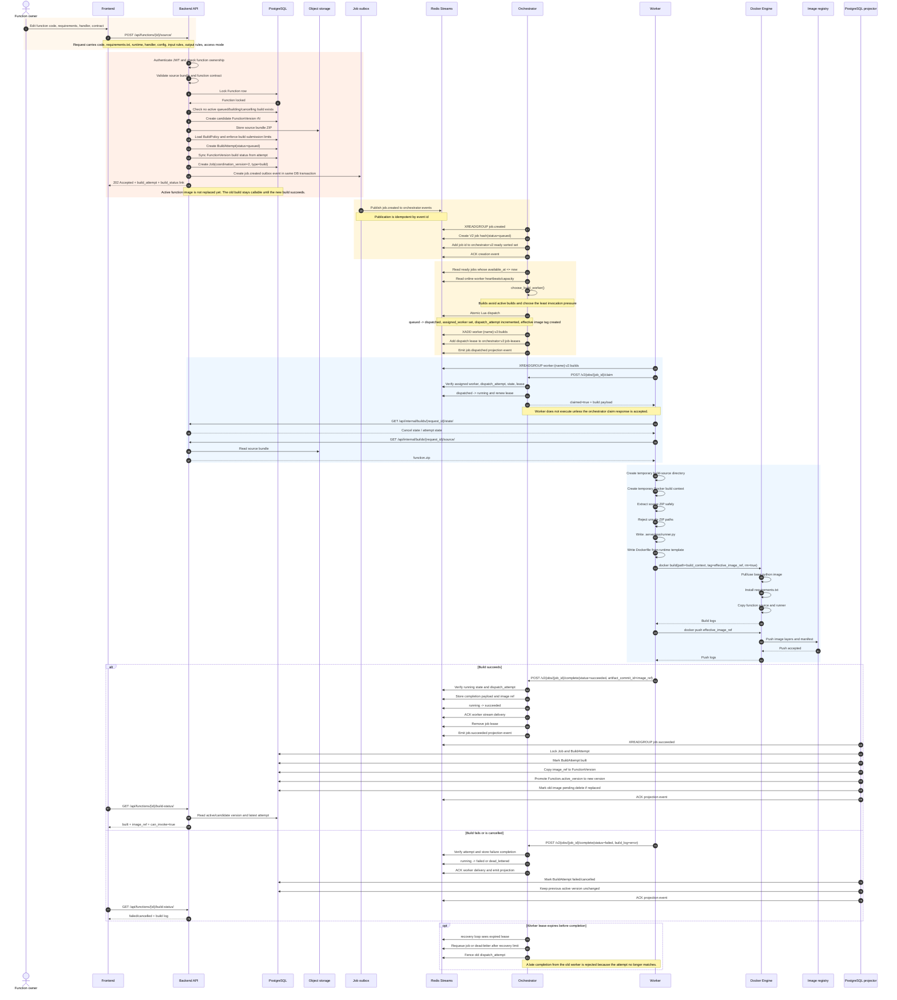

# Detailed Build Image Flow

This document explains what happens when a user edits a function and asks the
platform to build a new image for it.

The important correctness rule is:

**A new image is not exposed to callers until the build has succeeded and the
terminal build state has been projected back into PostgreSQL.**

That means a failed rebuild does not break the existing callable function. The
new version is treated as a candidate until it becomes the active version.

## Mermaid Diagram

The standalone Mermaid source is also available at:

`docs/diagrams/build_image_flow_detailed.mmd`



## Step-by-Step Explanation

### 1. The owner submits a source replacement

The user edits a function in the frontend. The important fields are:

- Python handler code
- `requirements.txt`
- runtime, currently Python runtime strings such as `python3.13`
- handler path, for example `handler.main`
- access mode
- input file contract
- output file contract
- config JSON, including things like timeout

The frontend sends this to:

```http
POST /api/functions/{function_id}/source/
Authorization: Bearer <owner-jwt>
```

This endpoint is used when the user wants to change a function's source and
therefore build a new image.

### 2. The backend validates ownership and contract

The backend first authenticates the JWT and checks that the function belongs to
the current user, unless the caller is an admin. Then it validates the submitted
source and function contract.

At this point, nothing has been built yet. The backend is only deciding whether
the request is acceptable.

The backend also locks the `Function` row inside a PostgreSQL transaction. That
lock matters because we do not want two source replacements/builds racing for
the same function.

### 3. The backend creates a candidate version

The platform does not overwrite the active function version immediately.
Instead, it creates a new `FunctionVersion`, usually named like `r2`, `r3`, and
so on.

That version is a candidate. It stores:

- runtime
- handler
- source bundle
- config
- allowed input settings
- declared output settings
- build status
- eventual image reference

The source bundle is stored through the backend's configured file storage. In
the deployed prototype, that storage is Parspack S3-compatible object storage.

### 4. The backend checks build policy and creates a build attempt

The backend loads `BuildPolicy` and checks submission limits before queueing.
This is where the platform rejects too many queued builds or too many builds in
a time window.

If accepted, it creates a `BuildAttempt` with:

- `status=queued`
- `attempt_number=1`
- a durable `request_id`
- a `build_id`
- initial log text such as `Build queued.`

The function version's visible build state is synced from this attempt.

### 5. The backend creates a V2 job and a job-created event

The backend creates a `Job` row linked to the build attempt. For the current V2
path, the job payload contains fields like:

- `type=function.build`
- `build_request_id`
- `build_id`
- `attempt_number`
- `function_id`
- `function_slug`
- `function_version_id`
- `runtime`
- `handler`
- `image_ref`

For V2 builds, the image tag is attempt-specific. The worker does not build
directly to the public active tag. It builds to an immutable candidate tag. This
prevents failed or stale attempts from replacing the working image.

The job and its outbox event are committed in the same PostgreSQL transaction.
That means if the transaction fails, neither the job nor the event exists. If it
succeeds, the system has a durable record that a build must be processed.

### 6. The API immediately returns `202 Accepted`

The user does not wait for Docker here. The backend returns immediately with a
queued build response.

The response includes:

- current build state
- candidate version details
- build attempt details
- a build-status URL
- a cancel-build URL
- whether the existing active version can still be invoked

The important user experience is:

> The build is queued. Keep polling build status.

### 7. The outbox relay publishes to Redis Streams

A relay process reads unpublished job outbox rows and publishes them to:

```text
orchestrator:events
```

This publication is idempotent. If the relay publishes but crashes before
marking the outbox row as published, replaying the event should not create
duplicate work.

### 8. The orchestrator receives the creation event

The orchestrator consumes `job.created` from Redis Streams using a consumer
group. For V2 jobs, it creates authoritative active job state in Redis:

- job status starts as `queued`
- original payload is stored in a Redis hash
- recovery limits are stored
- available time is recorded
- the job id is added to the ready sorted set

The ready set is what lets the orchestrator dispatch jobs only when they are
available. It also supports delayed retry/backoff behavior.

### 9. The orchestrator chooses a worker for the build

When a build is ready, the orchestrator checks online worker heartbeats and
queue/capacity data.

For builds, the current scheduling rule is intentionally conservative:

> Send a build to the worker that is not already building and has the lowest
> invocation pressure.

This protects invocations from getting stuck behind expensive Docker build
pressure while still allowing builds to make progress when all workers have
some light invocation work. Builds are heavier than invocations because they may
pull base images, install Python dependencies, compile packages, and push image
layers.

### 10. Dispatch is atomic

Dispatch is done with a Redis Lua script. The script does the important state
changes in one atomic Redis operation:

- verifies the job is still `queued`
- checks that it is available
- increments `dispatch_attempt`
- sets `status=dispatched`
- records `assigned_worker`
- records the worker stream
- creates an effective image reference with the dispatch attempt suffix
- writes a delivery to `worker:{name}:v2:builds`
- removes the job from the ready set

This is the point where the job moves from "available for scheduling" to
"assigned to a specific worker."

### 11. The worker receives the delivery but still must claim it

The worker reads its build stream:

```text
worker:{worker_name}:v2:builds
```

But reading from the stream is not enough permission to execute. The worker must
call the orchestrator claim API:

```http
POST /v2/jobs/{job_id}/claim
```

The claim includes:

- worker name
- dispatch attempt

The orchestrator verifies that:

- the job exists
- the job is assigned to that worker
- the dispatch attempt matches
- the job is still in the correct state
- the lease is still valid

If the claim is accepted, the orchestrator changes the job to `running`, renews
the lease, and returns the full build payload.

The worker only executes when `claimed=true`.

### 12. The worker downloads the source bundle

Before building, the worker checks whether the build was cancelled. Then it asks
the backend for the source bundle:

```http
GET /api/internal/builds/{build_request_id}/source/
X-Internal-Token: <shared-worker-secret>
```

The backend streams the source ZIP from object storage to the worker.

The worker uses protected internal backend endpoints for this because source
bundles are not public user downloads.

### 13. The worker prepares the Docker build context

The worker creates temporary directories and prepares a Docker build context:

1. Extract the source ZIP.
2. Reject unsafe ZIP paths, such as absolute paths or `..`.
3. Write `.serverless/runner.py`.
4. Write a generated `Dockerfile`.
5. Select the base image from the runtime, for example `python:3.13-slim`.

The generated build context is temporary. It is not meant to be permanent
platform state.

### 14. Docker builds the image

The worker calls Docker roughly like this:

```python
docker_client.images.build(
    path=str(build_path),
    tag=image_ref,
    rm=True,
)
```

Inside Docker, the expensive parts are usually:

- pulling or checking the Python base image
- installing `requirements.txt`
- compiling dependencies that do not have compatible wheels
- copying the source and runner into the image
- calculating image layers

If a dependency like `numpy` has a wheel available, the build is much faster. If
a dependency needs system libraries or compilation, this is where the build can
fail or become slow.

### 15. Docker pushes the image

After a successful build, the worker pushes the image to the registry:

```python
docker_client.images.push(image_ref, stream=True, decode=True)
```

In the current distributed prototype, workers need network access to the
registry on the control plane. If the worker and registry are on different
machines, this can add delay because image layers must move over the network.

### 16. The worker reports completion to the orchestrator

For V2 builds, the worker reports to the orchestrator, not directly to the
backend's old V1 reporting endpoint.

On success, the worker sends:

```json
{
  "worker_name": "worker-1",
  "dispatch_attempt": 1,
  "completion_id": "job-id:1:build",
  "status": "succeeded",
  "completion_payload": {
    "image_ref": "registry/functions/hello:v12-r2-a1-...-d1",
    "build_log": "Build completed.",
    "build_finished_at": "..."
  },
  "artifact_commit_id": "registry/functions/hello:v12-r2-a1-...-d1"
}
```

For builds, the artifact commit ID is the image reference. Builds do not need
the staged-output finalization path used by invocations because there are no
user output files to commit.

### 17. The orchestrator finalizes the build job

The orchestrator verifies the worker name and dispatch attempt again. If the
completion is valid, it:

- stores the completion payload in Redis
- changes the job from `running` to `succeeded` or `failed`
- ACKs the worker stream delivery
- removes the job lease
- emits a projection event

At this point, the orchestrator's active coordination job is terminal.

### 18. The projector updates PostgreSQL read models

The projector consumes terminal events from:

```text
orchestrator:v2:projections
```

For a successful build, it:

- marks the `BuildAttempt` as `built`
- writes the built image reference
- syncs the `FunctionVersion` build status
- promotes the candidate version to `Function.active_version`
- schedules old replaced images for deletion

For a failed build, it:

- marks the `BuildAttempt` as `failed`
- stores the build log/error
- keeps the previous active version unchanged

This is why the frontend can keep reading build status through the backend even
though the orchestrator owns active V2 job coordination.

### 19. The frontend polls build status

The frontend reads:

```http
GET /api/functions/{function_id}/build-status/
Authorization: Bearer <owner-jwt>
```

Typical states are:

- `queued`
- `building`
- `built`
- `failed`
- `cancelled`
- `cancelling`

Once the response says the function can be invoked, the new image is active.

## What Can Go Wrong

### Source validation fails

The backend rejects the request before creating a build attempt.

### Another build is already active

The backend rejects the new build because there is already a queued, building,
or cancelling version for the same function.

### Build limits reject the request

The backend rejects the request if the owner/function has too many queued or
recent builds.

### The outbox relay fails

The build request remains durable in PostgreSQL. The relay can publish the event
later.

### The orchestrator dies before dispatch

The job remains in Redis/stream state and can be recovered when the orchestrator
starts again.

### The worker dies during build

The lease expires. The orchestrator recovery loop can requeue the job or
dead-letter it if recovery has failed too many times.

### A stale worker reports late

The dispatch attempt no longer matches, so the orchestrator rejects the old
completion. This protects newer attempts.

### Docker build fails

The worker reports failure and build logs. The active function version remains
unchanged.

### Docker push succeeds but completion is lost

The worker retries completion with the same completion ID. The orchestrator's
completion handling is designed to be idempotent.

## Why This Flow Is Built This Way

The build path has three major design goals:

1. **Do not block the user request on Docker.**
   Building an image can take seconds or minutes, especially with dependencies.

2. **Do not expose broken images.**
   New source creates a candidate version. The active version changes only after
   success.

3. **Make worker failures recoverable.**
   Dispatch attempts, leases, Redis Streams, and projection events let the
   system recover from crashes without blindly trusting stale worker reports.
